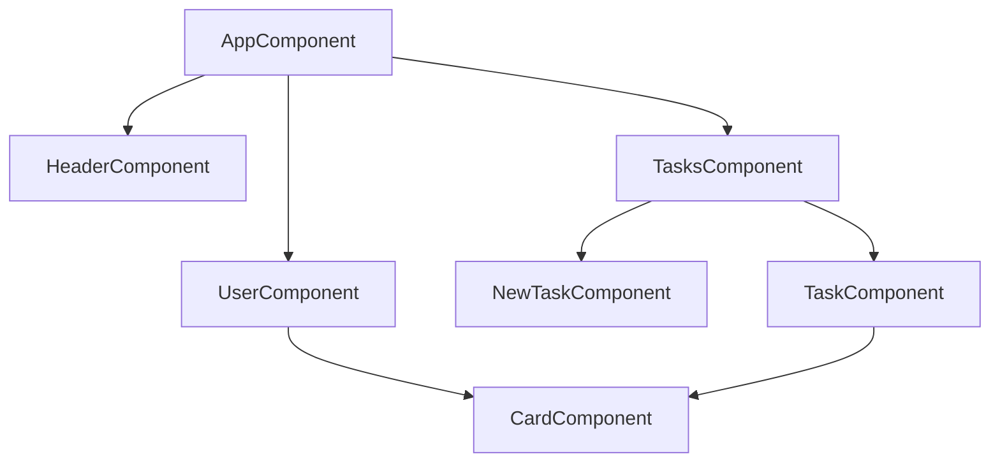

# Project documentation — Angular essentials (task management)

This document describes the **01-Angular-Essentials** sample app: what it does, how the code is organized, the **static and runtime data** it uses, and which **Angular concepts** each part illustrates.

---

## 1. Purpose and behavior

- **Goal:** A small **task management** UI where you pick a user, see that user’s tasks, add tasks, and mark tasks complete (which removes them).
- **Data:** Users come from a **TypeScript constant**. Tasks are managed by a **singleton service** with **default seed data** and **persistence** via `localStorage` under the key `tasks`.
- **Routing:** The router is **wired in** (`provideRouter`) but **`routes` is empty** — navigation is entirely **component-driven** (no URL segments for users or tasks).

---

## 2. Technical stack

| Item | Value |
|------|--------|
| Framework | Angular **19.x** (standalone components, application builder) |
| Language | TypeScript **~5.7** |
| Change detection | **Zone.js** (`provideZoneChangeDetection` with `eventCoalescing: true`) |
| Forms | **Template-driven** (`FormsModule`, `ngModel`) |
| Package name | `01-angular-essentials` |
| Build output | `dist/01-angular-essentials` |
| Document title (`index.html`) | **EasyTrack** (header branding shows **EasyTask**) |

---

## 3. Bootstrap and application config

- **`src/main.ts`** — Bootstraps the app with `bootstrapApplication(AppComponent, appConfig)` (no `AppModule`; **standalone root**).
- **`src/app/app.config.ts`** — `ApplicationConfig` provides:
  - **`provideZoneChangeDetection({ eventCoalescing: true })`** — classic Zone-based CD with coalesced events.
  - **`provideRouter(routes)`** — router ready; **`app.routes.ts`** currently exports **`routes: []`**.

---

## 4. Folder and component map

```
src/app/
├── app.component.*          Root layout: header, user list, conditional tasks panel
├── app.config.ts            Application-level providers
├── app.routes.ts            Route definitions (empty)
├── dummy-users.ts          Static user list
├── header/                  Top branding bar
├── user/                    User card + selection (outputs user id)
├── shared/card/             Presentational wrapper + content projection
└── tasks/
    ├── tasks.component.*    Tasks list + “Add Task” flow shell
    ├── tasks.service.ts     Task CRUD + localStorage
    ├── task/                Single task row + complete action
    └── new-task/            Modal dialog + form for new task
```

**Theory / alternate examples** (not wired into the main app tree): `user/UserComponentWithTheory/` contains commented or parallel examples for Zone vs signal-style patterns.

---

## 5. Component hierarchy and data flow



| From | To | Mechanism |
|------|-----|-----------|
| `AppComponent` | `UserComponent` | **`@Input`** — `id`, `avatar`, `name`, `selected` |
| `UserComponent` | `AppComponent` | **`@Output()` + `EventEmitter`** — `select` emits **`string`** (user id); parent uses **`$event`** |
| `AppComponent` | `TasksComponent` | **`@Input`** — `userId`, `name` (only when a user is selected) |
| `TasksComponent` | `NewTaskComponent` | **`@Input`** `userId`; **`@Output`** `close` |
| `TasksComponent` | `TaskComponent` | **`@Input`** `task` (full `Task` object) |

**Control flow in templates:** `@for` / `@if` / `@else` (Angular **control flow** syntax), not legacy `*ngFor`/`*ngIf` in the active templates (root still imports `NgFor`, `NgIf` for compatibility or unused legacy usage).

---

## 6. Project data (static)

### 6.1 Users (`dummy-users.ts`)

Exported as **`DUMMY_USERS`**. Each user has `id`, `name`, `avatar` (filename under `assets/users/`).

| id | name | avatar file |
|----|------|---------------|
| u1 | Jasmine Washington | user-1.jpg |
| u2 | Emily Thompson | user-2.jpg |
| u3 | Marcus Johnson | user-3.jpg |
| u4 | David Miller | user-4.jpg |
| u5 | Priya Patel | user-5.jpg |
| u6 | Arjun Singh | user-6.jpg |

### 6.2 Default tasks (before or without `localStorage`)

Defined inside **`TasksService`** as the initial `tasks` array:

| id | userId | title | summary | dueDate |
|----|--------|-------|---------|---------|
| t1 | u1 | Task 1 | Task 1 summary | 2023-10-01 |
| t2 | u2 | Task 2 | Task 2 summary | 2023-10-02 |
| t3 | u3 | Task 3 | Task 3 summary | 2023-10-03 |

On service construction, if **`localStorage.getItem('tasks')`** returns JSON, it **replaces** this in-memory list.

### 6.3 TypeScript models (`task.model.ts`)

- **`Task`** — `id`, `userId`, `title`, `summary`, `dueDate` (all strings).
- **`NewTaskData`** — shape used when adding a task: `title`, `summary`, `date`.

---

## 7. Services and state

### `TasksService` (`@Injectable({ providedIn: 'root' })`)

| Responsibility | Detail |
|----------------|--------|
| **Read** | `getUserTasks(userId)` — filters by `userId`. |
| **Create** | `addTask(taskData, userId)` — builds object with `id: 't' + (this.tasks.length + 1)`, **`unshift`** into array, then **`saveTask()`**. |
| **Delete** | `removeTask(id)` — filter out by id, then **`saveTask()`**. |
| **Persistence** | `private saveTask()` — `localStorage.setItem('tasks', JSON.stringify(this.tasks))`. |

**Angular concepts:** **root-provided singleton**, **dependency injection** in components via **constructor** (`TasksComponent`) or **`inject(TasksService)`** (`TaskComponent`, `NewTaskComponent`).

---

## 8. Angular concepts by feature

| Concept | Where it appears |
|---------|------------------|
| **Standalone components** | Every `@Component` uses `imports: [...]` instead of an NgModule feature module. |
| **Component selector** | e.g. `app-root`, `app-user`, `app-tasks`. |
| **`@Input` / `@Output`** | `UserComponent`, `TasksComponent`, `TaskComponent`, `NewTaskComponent`; `required: true` on several inputs. |
| **`inject()`** | `TaskComponent`, `NewTaskComponent` for `TasksService` without a constructor. |
| **Constructor DI** | `TasksComponent` injects `TasksService` with `private tasksService`. |
| **Getters as template APIs** | `AppComponent.selectedUser`, `TasksComponent.selectedUserTasks`, `UserComponent.imagePath`. |
| **Content projection** | `CardComponent` template uses **`<ng-content />`** so parents wrap arbitrary markup inside `<app-card>`. |
| **Built-in pipe** | `DatePipe` imported in `TaskComponent`; template uses **`date:'fullDate'`**. |
| **Template-driven forms** | `NewTaskComponent`: `FormsModule`, **`[(ngModel)]`**, **`(ngSubmit)`**. |
| **Host / dialog markup** | `NewTaskComponent` uses `<dialog open>`, backdrop click to cancel. |
| **Control flow** | `@for` with **`track`**, `@if` / `@else` in `app.component.html`, `tasks.component.html`. |
| **Property / event binding** | e.g. `[src]`, `[class.active]`, `(click)`. |
| **Router setup (unused paths)** | `provideRouter` + empty `routes` — ready for future lazy routes or guards. |

**Comments in code** also contrast **decorator-based** vs **signal-based** `input()` / `output()` for `UserComponent` (signal version left commented).

---

## 9. Assets and global styles

- **`public/`** and **`src/assets/`** — configured in `angular.json` (e.g. favicon, task logo, user images).
- **`src/styles.css`** — global `body` background and typography baseline.

---

## 10. How to run

From the project root:

- **`npm start`** — `ng serve` (development server).
- **`npm run build`** — production build to `dist/01-angular-essentials`.

---

## 11. Optional cleanup note

`AppComponent` imports **`TaskComponent`** and **`NewTaskComponent`** in `imports` but the template only uses **`TasksComponent`** (which itself imports those children). Removing unused standalone imports would align the root component with what the template actually references.

---

*This file was generated to match the repository as of the documentation pass; if you add routing or APIs, update the “Routing” and “Project data” sections accordingly.*
